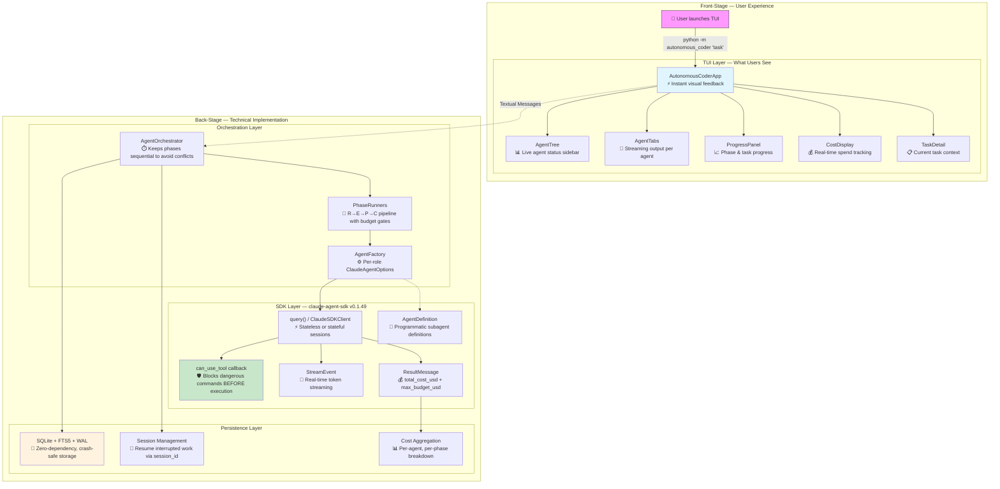

# TUI Agent Orchestration System — Architecture Overview

**Type:** Architecture Diagram
**Last Updated:** 2026-03-20
**Related Files:**
- `app.py` — Textual App entry point
- `orchestrator.py` — Phase pipeline engine
- `agent_factory.py` — ClaudeAgentOptions builder
- `memory.py` — SQLite + FTS5 persistence
- `security.py` — Command allowlist + can_use_tool callback

## Purpose

Shows how the four-layer architecture (TUI → Orchestration → SDK → Persistence) delivers real-time visibility into autonomous coding sessions, replacing opaque CLI output with a live multi-pane dashboard.

## Diagram

## Key Insights

- **User impact**: Every agent action is visible in real-time through Textual Message dispatch — no more watching blank terminal output
- **Security**: `can_use_tool` callback blocks dangerous Bash commands BEFORE execution (not after, like the legacy client.py)
- **Cost control**: SDK supports `max_budget_usd` for hard caps; application also tracks `ResultMessage.total_cost_usd` per-role for granular control
- **Streaming**: `StreamEvent` (public in v0.1.49) enables real-time token-by-token output via `include_partial_messages=True`
- **Subagents**: `AgentDefinition` enables programmatic subagent definitions via the `agents` parameter on `ClaudeAgentOptions`
- **Resilience**: SQLite WAL mode + SDK `resume`/`fork_session` means interrupted work can be continued

## Change History

- **2026-03-20:** Updated SDK layer to reflect verified v0.1.49 capabilities (max_budget_usd, AgentDefinition, ClaudeSDKClient, StreamEvent)
- **2026-03-19:** Initial architecture diagram created during Phase A implementation
