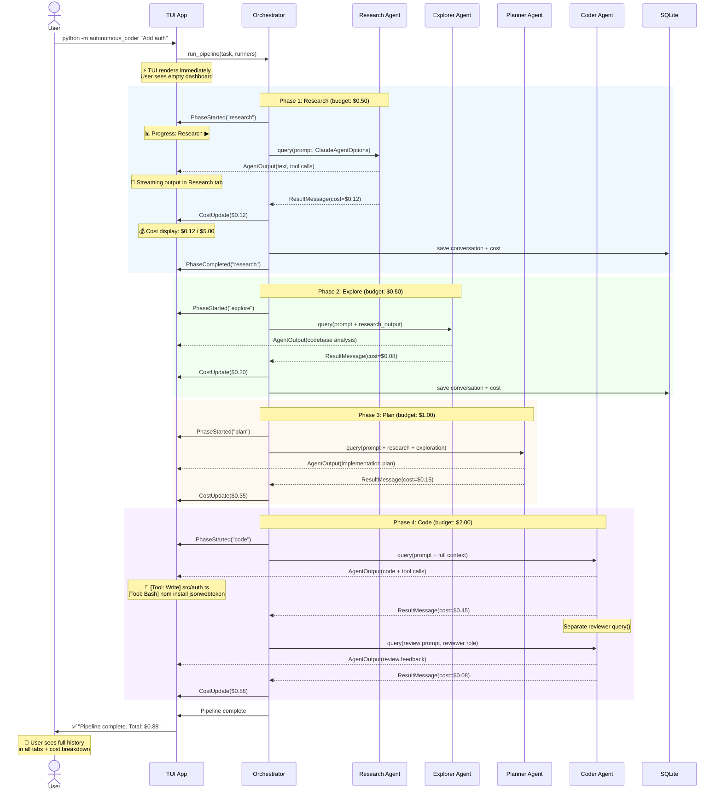

# Agent Pipeline — User Journey

**Type:** Sequence Diagram
**Last Updated:** 2026-03-19
**Related Files:**
- `orchestrator.py` — Pipeline execution
- `agents/research.py`, `agents/explorer.py`, `agents/planner.py`, `agents/coder.py`
- `messages.py` — Textual Message types
- `memory.py` — Conversation persistence

## Purpose

Shows the complete user journey from launching a task through the four-phase pipeline, highlighting what the user sees at each stage and how budget/cost tracking works.

## Diagram

## Key Insights

- **User sees progress immediately** — TUI renders before any agent starts, showing the empty dashboard layout
- **Each phase chains data forward** — Research output feeds Explorer, Explorer feeds Planner, Planner feeds Coder
- **Budget is enforced per-role** — If research exceeds $0.50, that agent stops but the pipeline continues
- **Reviewer is a separate query()** — NOT a subagent parameter; appears as its own tab in the TUI
- **All conversations persisted** — SQLite stores every message for session resume

## Change History

- **2026-03-19:** Initial journey diagram created
