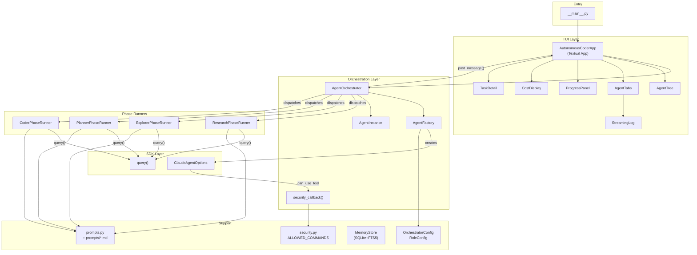
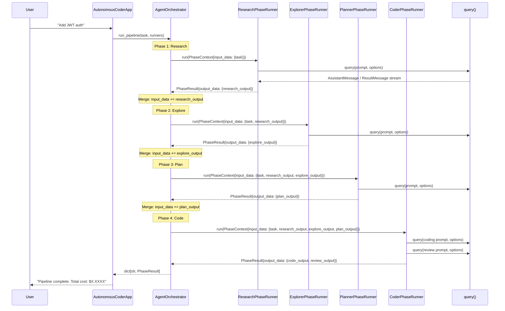
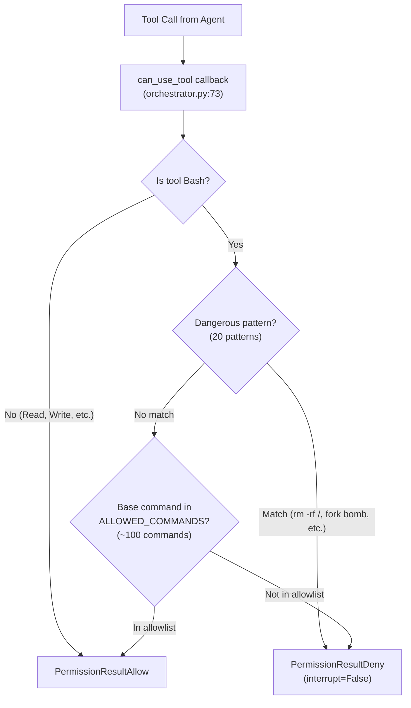
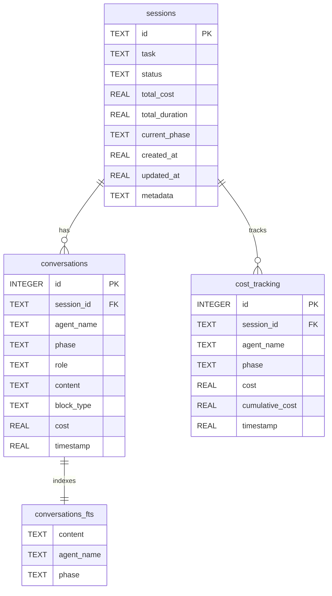

# Architecture — autonomous-coder v2.0

## System Overview

Autonomous Coder is a TUI-based multi-agent orchestration system that drives autonomous coding through a four-phase pipeline: **Research, Explore, Plan, Code**. Each phase is executed by a dedicated Claude agent with its own model, tools, budget limit, and security constraints — all visible in real-time through a Textual terminal dashboard.

The system is built on three foundational layers:

1. **TUI Layer** — Textual v7.0.0 widgets for real-time agent streaming, progress tracking, and cost display
2. **Orchestration Layer** — Sequential pipeline engine with the `PhaseRunner` protocol, agent lifecycle management, and budget enforcement
3. **SDK Layer** — `claude-agent-sdk` v0.1.49 providing `query()` async iteration, `ClaudeAgentOptions` configuration, and `can_use_tool` security callbacks

```
┌──────────────────────────────────────────────────────────────────┐
│                    TUI LAYER (Textual v7.0.0)                    │
│  AgentTree │ AgentTabs │ ProgressPanel │ CostDisplay │ TaskDetail│
├──────────────────────────────────────────────────────────────────┤
│                    ORCHESTRATION LAYER                            │
│  AgentOrchestrator │ PhaseRunners (R→E→P→C) │ AgentFactory       │
├──────────────────────────────────────────────────────────────────┤
│                SDK LAYER (claude-agent-sdk v0.1.49)               │
│  query() │ ClaudeAgentOptions │ can_use_tool │ StreamEvent        │
├──────────────────────────────────────────────────────────────────┤
│                    PERSISTENCE LAYER                              │
│  SQLite + FTS5 + WAL │ Session Management │ Cost Aggregation      │
└──────────────────────────────────────────────────────────────────┘
```

### Entry Points

| Entry Point | File | Description |
|---|---|---|
| CLI with task | `python -m autonomous_coder "Add auth"` | `__main__.py` launches `AutonomousCoderApp` with task, auto-starts pipeline |
| CLI interactive | `python -m autonomous_coder` | Launches TUI with input widget; user types task and presses Enter |
| Programmatic | `AutonomousCoderApp(task=...).run()` | Direct Python API for embedding |
| Headless | `AgentOrchestrator(config).run_pipeline(task, runners)` | No TUI; returns `dict[str, PhaseResult]` |

---

## Component Architecture



### Module Responsibilities

| Module | File | Responsibility |
|---|---|---|
| `app.py` | `src/autonomous_coder/app.py` | Textual App subclass; composes widget layout; handles all 8 message types; manages pipeline worker lifecycle |
| `orchestrator.py` | `src/autonomous_coder/orchestrator.py` | Defines `PhaseRunner` protocol, `PhaseContext`/`PhaseResult` data contracts; runs sequential pipeline; dispatches Textual messages; provides `run_agent()` helper and `security_callback` |
| `agent_factory.py` | `src/autonomous_coder/agent_factory.py` | Builds `ClaudeAgentOptions` per role; assembles MCP server dicts; injects `SERENA_PROJECT` env; exposes budget limits |
| `agent_instance.py` | `src/autonomous_coder/agent_instance.py` | Tracks per-agent state machine (`PENDING` → `RUNNING` → `COMPLETED`/`FAILED`/`CANCELLED`); accumulates cost; computes duration |
| `config.py` | `src/autonomous_coder/config.py` | `OrchestratorConfig` with 5 default `RoleConfig` entries; `MCP_SERVERS` registry (4 servers) |
| `security.py` | `src/autonomous_coder/security.py` | `ALLOWED_COMMANDS` set (~100 commands); `DANGEROUS_PATTERNS` list (20 patterns); `is_command_allowed()` validator; `bash_security_hook()`; `get_security_permissions()` |
| `memory.py` | `src/autonomous_coder/memory.py` | `MemoryStore` class with SQLite + FTS5 + WAL; `sessions`, `conversations`, `cost_tracking` tables; full-text search over conversation content |
| `messages.py` | `src/autonomous_coder/messages.py` | 8 Textual `Message` subclasses for inter-widget communication |
| `prompts.py` | `src/autonomous_coder/prompts.py` | Template loader from `prompts/*.md` files; `format_prompt()` with `{variable}` substitution; fallback inline templates; 4 role-specific prompt builders |
| `agents/` | `src/autonomous_coder/agents/` | 4 `PhaseRunner` implementations (one per phase) |
| `widgets/` | `src/autonomous_coder/widgets/` | 6 Textual widgets for the TUI |

---

## Four-Phase Pipeline

### Data Flow

Each phase receives a `PhaseContext` and returns a `PhaseResult`. The orchestrator merges each phase's `output_data` into the next phase's `input_data`, creating a cumulative context that flows forward through the pipeline.



### Phase Details

| Phase | Runner | Role Config Key | MCP Servers | Key Output | Budget |
|---|---|---|---|---|---|
| **Research** | `ResearchPhaseRunner` | `research` | Firecrawl, Context7 | `research_output` — structured JSON with MCP servers, libraries, recommendations | $0.50 |
| **Explore** | `ExplorerPhaseRunner` | `explore` | Serena | `explore_output` — codebase structure, symbols, patterns, impact areas | $0.50 |
| **Plan** | `PlannerPhaseRunner` | `plan` | Sequential Thinking, Serena | `plan_output` — ordered task list with dependencies, files, test criteria | $1.00 |
| **Code** | `CoderPhaseRunner` | `code` + `reviewer` | Serena, Context7 | `code_output` + `review_output` — implementation + code review feedback | $2.00 + $0.25 |

### Pipeline Control

The orchestrator exposes three control methods:

- **`pause()`** — Sets `_paused = True`; pipeline sleeps between phases (does not interrupt running agent)
- **`resume()`** — Clears the pause flag
- **`cancel()`** — Sets `_cancelled = True`; current agent runs to its next yield point, then pipeline stops

Pipeline aborts on phase failure: if any `PhaseResult.success` is `False`, subsequent phases are skipped.

### Cumulative Context Merging

```python
# orchestrator.py, run_pipeline() — line 218
input_data = {**input_data, **result.output_data}
```

Each phase's `output_data` dict is merged into the running `input_data`. This means:
- **Research** outputs `{"research_output": "..."}`
- **Explore** receives `{"task": "...", "research_output": "..."}` and outputs `{"explore_output": "..."}`
- **Plan** receives all three and outputs `{"plan_output": "..."}`
- **Code** receives the full accumulated context

---

## Message System

Communication between the orchestration layer and the TUI uses Textual's built-in `post_message()` system. The orchestrator posts messages; the `AutonomousCoderApp` handles them via `on_<message_type>()` methods and routes updates to the appropriate widgets.

### Message Types

| Message Class | Attributes | Posted By | Handled By |
|---|---|---|---|
| `AgentStarted` | `agent_name`, `phase` | `run_agent()` | `AgentTree.add_agent()`, `AgentTabs.add_agent_tab()` |
| `AgentOutput` | `agent_name`, `text`, `block_type` | `run_agent()` | `AgentTabs.append_output()` |
| `AgentCompleted` | `agent_name`, `phase`, `cost`, `duration`, `success`, `error` | `run_agent()` | `AgentTree.set_agent_complete()` |
| `AgentError` | `agent_name`, `error`, `phase` | `run_agent()` | `AgentTree`, `AgentTabs` (error styling) |
| `CostUpdate` | `agent_name`, `cost`, `total_cost` | `run_agent()` | `CostDisplay.record_cost()` |
| `SecurityBlock` | `agent_name`, `tool_name`, `reason` | Security layer | `AgentTabs` (error block) |
| `PhaseStarted` | `phase`, `phase_index`, `total_phases` | `run_pipeline()` | `ProgressPanel.set_phase()` |
| `PhaseCompleted` | `phase`, `phase_index`, `cost`, `duration`, `success` | `run_pipeline()` | `ProgressPanel` |

### Message Flow Pattern

```
AgentOrchestrator._post_message(msg)
    → AutonomousCoderApp.post_message(msg)    # Textual message bus
        → App.on_<message_type>(msg)          # Dispatched by Textual's handler resolution
            → Widget.method(msg.attributes)   # Widget updates its state/display
```

### Block Types

`AgentOutput.block_type` determines rendering in `AgentTabs` and `StreamingLog`:

| Block Type | Source | Rendering |
|---|---|---|
| `"text"` | `TextBlock` from `AssistantMessage` | Plain text with markup support |
| `"tool"` | `ToolUseBlock` from `AssistantMessage` | `[bold cyan][tool] command...[/bold cyan]` |
| `"error"` | Exception or security block | `[bold red]...[/bold red]` |
| `"thinking"` | Extended thinking output | `[dim italic]...[/dim italic]` |
| `"result"` | Phase result summary | `[green]...[/green]` |

---

## Widget Architecture

### Layout Hierarchy

```
AutonomousCoderApp (Screen, layout: vertical)
├── Header
├── Input#task-input (dock: bottom, height: 3)
└── Horizontal#content (height: 1fr)
    ├── Vertical#sidebar (width: 30)
    │   ├── AgentTree#agent-tree (height: 60%)
    │   └── ProgressPanel#progress (height: 40%)
    └── Vertical#main (height: 100%)
        ├── AgentTabs#agent-tabs (height: 70%)
        │   └── [TabPane per agent]
        │       └── RichLog (highlight, markup)
        └── Horizontal#details (height: 30%)
            ├── TaskDetail#task-detail (width: 1fr)
            └── CostDisplay#cost-display (width: 30)
```

### Widget Details

| Widget | Class | File | Reactive Properties | Key Methods |
|---|---|---|---|---|
| **AgentTree** | `Tree` subclass | `widgets/agent_tree.py` | — | `add_agent(name, phase)`, `set_agent_running(name)`, `set_agent_complete(name, success)` |
| **AgentTabs** | `TabbedContent` subclass | `widgets/agent_tabs.py` | — | `add_agent_tab(name)`, `append_output(name, text, block_type)`, `focus_agent(name)` |
| **StreamingLog** | `RichLog` subclass | `widgets/streaming_log.py` | — | `on_agent_output(message)` — renders with Rich markup per block_type |
| **ProgressPanel** | `Widget` subclass | `widgets/progress_panel.py` | `current_phase`, `phase_index`, `total_phases`, `tasks` | `set_phase(phase, index, total)`, `update_tasks(tasks)` |
| **TaskDetail** | `Widget` subclass | `widgets/task_detail.py` | `task_name`, `task_status`, `task_files`, `task_dependencies`, `estimated_cost` | `update_task(name, status, files, deps, cost)` |
| **CostDisplay** | `Widget` subclass | `widgets/cost_display.py` | `total_cost`, `budget_limit`, `agent_costs` | `record_cost(agent_name, cost, total_cost)` |

### Reactive Update Pattern

Widgets use Textual's `reactive` properties with `watch_*` methods for automatic DOM updates:

```python
# cost_display.py — reactive property with watcher
total_cost: reactive[float] = reactive(0.0)

def watch_total_cost(self, cost: float) -> None:
    self.query_one("#total-cost", Static).update(f"[bold]${cost:.4f}[/bold]")
    self._check_budget_warning(cost)
```

When `CostDisplay.total_cost` is assigned, `watch_total_cost` fires automatically, updating the DOM element and checking the 80% budget warning threshold.

### Keyboard Bindings

| Key | Action | Method |
|---|---|---|
| `q` | Quit application | `action_quit()` (built-in) |
| `p` | Pause pipeline between phases | `action_pause()` → `orchestrator.pause()` |
| `r` | Resume pipeline | `action_resume()` → `orchestrator.resume()` |
| `c` | Cancel pipeline | `action_cancel_agent()` → `orchestrator.cancel()` |
| `Tab` | Cycle agent output tabs | `action_cycle_agents()` → `AgentTabs.action_next_tab()` |
| `/` | Open command palette | `action_command_palette()` (built-in) |

---

## Security Model

Defense-in-depth with three layers, all evaluated **before** any tool execution occurs.



### Layer 1: `can_use_tool` Callback

Defined in `orchestrator.py` (line 73), registered on every `ClaudeAgentOptions` via `AgentFactory.create_options()`.

```python
async def security_callback(tool_name, tool_input, ctx):
    if tool_name == "Bash":
        is_allowed, reason = is_command_allowed(command)
        if not is_allowed:
            return PermissionResultDeny(behavior="deny", message=..., interrupt=False)
    return PermissionResultAllow(behavior="allow", ...)
```

Key design choice: `interrupt=False` on deny means the agent can try alternative commands instead of being terminated.

Non-Bash tools (Read, Write, Edit, Glob, Grep, MCP tools) are always allowed through the callback because file-system access is governed at the session level by `permission_mode="acceptEdits"`.

### Layer 2: Command Allowlist

`security.py` defines `ALLOWED_COMMANDS` — a set of ~100 base command names organized into categories:

| Category | Examples |
|---|---|
| Package managers | `npm`, `pip`, `cargo`, `brew`, `uv` |
| Version control | `git` |
| Build tools | `make`, `cmake`, `gradle`, `bazel` |
| Runtimes/compilers | `node`, `python3`, `rustc`, `java`, `swift` |
| Linters/formatters | `eslint`, `prettier`, `ruff`, `mypy` |
| Shell utilities | `cat`, `ls`, `grep`, `find`, `mkdir`, `cp` |
| Dev utilities | `curl`, `jq`, `docker`, `kubectl` |
| Cloud CLIs | `aws`, `gcloud`, `vercel`, `fly` |

Command extraction: the first whitespace-delimited token is extracted, path-prefixed commands are stripped (`/usr/bin/git` becomes `git`), and `./gradlew`/`./mvnw` wrapper scripts are explicitly allowed.

### Layer 3: Dangerous Pattern Blocklist

20 patterns checked **before** the allowlist, matching against the full command string (case-insensitive):

```
rm -rf /       rm -rf /*      rm -rf ~       rm -rf $HOME
> /dev/sda     mkfs           dd if=         :(){:|:&};:
chmod 777      chmod -R 777   sudo rm        sudo chmod
sudo chown     curl | sh      curl | bash    wget | sh
wget | bash    eval $(        base64 -d |
```

### Layer 4: Permission Scoping

`get_security_permissions()` in `security.py` (line 201) defines granular file-system scoping:
- File operations (Read, Write, Edit, Glob, Grep) scoped to project path
- Bash tool allowed with hook validation
- Serena MCP tools individually allowlisted
- Puppeteer MCP tools allowed via glob pattern

---

## Persistence Layer

### MemoryStore (`memory.py`)

SQLite-backed persistence with three tables and full-text search.



### SQLite Configuration

| Setting | Value | Purpose |
|---|---|---|
| `journal_mode` | WAL (Write-Ahead Logging) | Concurrent reads during writes; crash recovery |
| `foreign_keys` | ON | Referential integrity between sessions and conversations |

### Full-Text Search (FTS5)

The `conversations_fts` virtual table enables fast content search across all conversation entries:

```python
# Search across all sessions
store.search_conversations("JWT authentication")

# Search within a specific session
store.search_conversations("error handling", session_id="abc123")
```

FTS5 is kept in sync via three triggers (`conversations_ai`, `conversations_ad`, `conversations_au`) that fire on INSERT, DELETE, and UPDATE of the `conversations` table.

### Indexes

| Index | Table | Column(s) | Purpose |
|---|---|---|---|
| `idx_conv_session` | `conversations` | `session_id` | Fast session lookup |
| `idx_conv_agent` | `conversations` | `agent_name` | Filter by agent |
| `idx_cost_session` | `cost_tracking` | `session_id` | Cost aggregation per session |

### Key Operations

| Method | Description |
|---|---|
| `create_session(id, task)` | Initialize a new pipeline session |
| `add_conversation(entry)` | Record an agent message (user/assistant/tool) |
| `search_conversations(query)` | FTS5 full-text search across content |
| `record_cost(session_id, agent, phase, cost, cumulative)` | Append cost event and update session total |
| `get_cost_breakdown(session_id)` | Aggregate cost per agent via `SUM(cost) GROUP BY agent_name` |

---

## Configuration

### OrchestratorConfig (`config.py`)

```python
@dataclass
class OrchestratorConfig:
    project_path: Path
    total_budget: float = 5.0
    roles: dict[str, RoleConfig] = ...  # 5 default roles
```

### RoleConfig

```python
@dataclass
class RoleConfig:
    model: str           # e.g. "claude-sonnet-4-5-20250514"
    tools: list[str]     # Allowed Claude Code tools
    mcp_keys: list[str]  # Keys into MCP_SERVERS registry
    budget_limit: float  # Per-role budget cap (USD)
    max_turns: int       # Maximum agentic turns
```

### Default Role Configurations

| Role | Model | Tools | MCP Servers | Budget | Max Turns |
|---|---|---|---|---|---|
| `research` | claude-sonnet-4-5 | Read, Grep, Glob, WebSearch, WebFetch | Firecrawl, Context7 | $0.50 | 25 |
| `explore` | claude-sonnet-4-5 | Read, Grep, Glob | Serena | $0.50 | 20 |
| `plan` | claude-sonnet-4-5 | Read, Grep, Glob | Sequential Thinking, Serena | $1.00 | 10 |
| `code` | claude-sonnet-4-5 | Read, Write, Edit, Bash, Grep, Glob | Serena, Context7 | $2.00 | 30 |
| `reviewer` | claude-sonnet-4-5 | Read, Grep, Glob | Serena | $0.25 | 10 |

Note: Only the `code` role has write-capable tools (Write, Edit, Bash). Research, Explore, Plan, and Reviewer are read-only.

### MCP Server Registry

| Key | Command | Purpose | Phase Usage |
|---|---|---|---|
| `serena` | `uvx serena` | Semantic code analysis (symbols, references, patterns) | Explore, Plan, Code, Review |
| `sequential-thinking` | `npx @modelcontextprotocol/server-sequential-thinking` | Step-by-step reasoning | Plan |
| `Context7` | `npx @upstash/context7-mcp` | Library documentation lookup | Research, Code |
| `firecrawl-mcp` | `npx firecrawl-mcp` | Web research and scraping | Research |

### Environment Injection

`AgentFactory.create_options()` automatically injects `SERENA_PROJECT` into the Serena MCP server's environment when it is included in a role's `mcp_keys`:

```python
# agent_factory.py, line 51
if "serena" in mcp_servers:
    mcp_servers["serena"]["env"]["SERENA_PROJECT"] = str(self.config.project_path)
```

### Budget Enforcement

Budget is tracked at two levels:

1. **Application-level** (primary) — `AgentInstance.cost` accumulates `ResultMessage.total_cost_usd` after each `query()` iteration. When `agent.budget_exceeded` returns `True`, the agent loop breaks.
2. **SDK-level** (available) — `ClaudeAgentOptions.max_budget_usd` can enforce a hard cap within the SDK itself. Currently unused but available for stricter enforcement.

---

## Prompt System

### Template Loading

Prompts are stored as Markdown files in `src/autonomous_coder/prompts/` and loaded via `prompts.py`:

```
prompts.py                          # Loader + formatters + fallback templates
prompts/
├── researcher_prompt.md            # Research phase system prompt
├── explorer_prompt.md              # Explore phase system prompt
├── planner_prompt.md               # Plan phase system prompt
├── coder_prompt.md                 # Code phase system prompt
└── orchestrator_prompt.md          # Base orchestrator prompt
```

The loader uses Python `str.format()` with `{variable}` placeholders:

```python
template = load_prompt_template("researcher_prompt")   # reads .md file
formatted = format_prompt(template, task=..., project_path=...)
```

### Fallback Mechanism

If a template file is missing, `ensure_prompt_templates_exist()` creates it from inline fallback constants (`FALLBACK_RESEARCHER_PROMPT`, etc.). Each fallback contains the complete prompt with JSON output format specifications.

### Prompt Builder Functions

| Function | Inputs | Used By |
|---|---|---|
| `get_researcher_prompt(task, project_path, additional_context)` | Task + project path | `ResearchPhaseRunner` |
| `get_explorer_prompt(task, project_path, additional_context)` | Task + project path + research output | `ExplorerPhaseRunner` |
| `get_planner_prompt(task, exploration_results, project_path)` | Task + explore output + project path | `PlannerPhaseRunner` |
| `get_coder_prompt(task, plan, completed_tasks, project_path)` | Task dict + plan dict + completed IDs | `CoderPhaseRunner` |
| `get_system_prompt()` | (none) | Base system prompt for all agents |

---

## Design Patterns

### 1. PhaseRunner Protocol (Structural Typing)

The core extensibility mechanism. Any object with an `async def run(context: PhaseContext) -> PhaseResult` method satisfies the protocol — no inheritance required.

```python
# orchestrator.py, line 62
@runtime_checkable
class PhaseRunner(Protocol):
    async def run(self, context: PhaseContext) -> PhaseResult: ...
```

This is a **structural protocol** (PEP 544) decorated with `@runtime_checkable`, meaning:
- No base class inheritance needed
- `isinstance(runner, PhaseRunner)` works at runtime
- Duck typing with static type checker support

### 2. Factory Pattern (AgentFactory)

`AgentFactory` encapsulates the complex construction of `ClaudeAgentOptions`:

- Maps `RoleConfig` fields to SDK option fields
- Assembles MCP server dicts (must be `dict`, not `list`)
- Injects environment variables for specific MCP servers
- Attaches the security callback
- Separates budget limit from SDK options (application-level concern)

### 3. Message Bus (Textual post_message)

The orchestrator communicates with the TUI through Textual's built-in message system rather than direct widget references:

```python
# orchestrator.py — post message to app
self._post_message(AgentStarted(agent_name=agent.name, phase=phase))

# app.py — handler dispatched by Textual
def on_agent_started(self, message: AgentStarted) -> None:
    tree.add_agent(message.agent_name, message.phase)
```

This decouples the orchestrator from the TUI. When `app=None` (headless mode), `_post_message()` is a no-op.

### 4. Data Contract Pattern (PhaseContext / PhaseResult)

Phases communicate via explicit dataclass contracts:

```python
@dataclass
class PhaseContext:
    phase_name: str
    input_data: dict[str, Any]     # Accumulated data from prior phases
    config: OrchestratorConfig
    budget_remaining: float
    task_description: str = ""

@dataclass
class PhaseResult:
    phase_name: str
    output_data: dict[str, Any]    # Merged into next phase's input_data
    cost_incurred: float = 0.0
    duration_seconds: float = 0.0
    success: bool = True
    error: str | None = None
```

### 5. Agent State Machine

`AgentInstance` implements a simple state machine:

```
PENDING ──start()──→ RUNNING ──complete()──→ COMPLETED
                          │
                          ├──complete(error)──→ FAILED
                          │
                          └──cancel()──→ CANCELLED
```

### 6. Reactive Properties (Textual)

Widgets use Textual's `reactive` descriptor for automatic UI updates:

```python
total_cost: reactive[float] = reactive(0.0)

def watch_total_cost(self, cost: float) -> None:
    # Automatically called when total_cost is assigned
    self.query_one("#total-cost", Static).update(...)
```

### 7. Async Generator Streaming

Each `PhaseRunner` consumes the SDK's `query()` async generator, processing `AssistantMessage` and `ResultMessage` objects as they arrive:

```python
async for msg in query(prompt=prompt, options=options):
    if isinstance(msg, AssistantMessage):
        for block in msg.content:
            if isinstance(block, TextBlock): ...
            elif isinstance(block, ToolUseBlock): ...
    elif isinstance(msg, ResultMessage):
        cost = msg.total_cost_usd or 0.0
```

### 8. Dual-Pass Code Phase

`CoderPhaseRunner` uniquely runs two sequential `query()` calls:
1. **Coding pass** — Uses `code` role config with write tools (Read, Write, Edit, Bash)
2. **Review pass** — Uses `reviewer` role config with read-only tools; reviews the coding output

This provides built-in code review without requiring SDK subagents.

---

## Extension Guide

### Adding a New Phase

1. **Create the PhaseRunner** in `src/autonomous_coder/agents/`:

```python
# agents/lint.py
class LintPhaseRunner:
    def __init__(self, factory: AgentFactory) -> None:
        self.factory = factory

    async def run(self, context: PhaseContext) -> PhaseResult:
        # Build prompt from context.input_data
        # Call query() with factory.create_options()
        # Return PhaseResult with output_data
        ...
```

2. **Add a RoleConfig** in `config.py`:

```python
"lint": RoleConfig(
    model="claude-sonnet-4-5-20250514",
    tools=["Read", "Bash", "Grep"],
    mcp_keys=["serena"],
    budget_limit=0.25,
    max_turns=10,
),
```

3. **Register in the pipeline** — add to `PHASE_ORDER` in `orchestrator.py` and to the `runners` dict in `app.py`:

```python
# orchestrator.py
PHASE_ORDER = ["research", "explore", "plan", "lint", "code"]

# app.py
runners["lint"] = LintPhaseRunner(self._orchestrator.factory)
```

4. **Export** from `agents/__init__.py` and `__init__.py`.

### Adding a New Widget

1. Create in `src/autonomous_coder/widgets/`
2. Export from `widgets/__init__.py`
3. Add to `AutonomousCoderApp.compose()` in the desired layout position
4. Add a message handler in `app.py` if it needs orchestrator data

### Adding a New Message Type

1. Define in `messages.py` as a `Message` subclass
2. Add a handler method `on_<message_type>()` in `app.py`
3. Post from the orchestrator via `self._post_message()`

### Adding a New MCP Server

1. Add to `MCP_SERVERS` dict in `config.py`:

```python
"my-server": {
    "command": "npx",
    "args": ["-y", "my-mcp-server"],
    "env": {"API_KEY": "${MY_API_KEY}"},
},
```

2. Reference the key in the appropriate `RoleConfig.mcp_keys` list.

### Adding a New Security Rule

- **Allow a command**: Add to `ALLOWED_COMMANDS` set in `security.py`
- **Block a pattern**: Add to `DANGEROUS_PATTERNS` list in `security.py`
- **Custom validation**: Extend `is_command_allowed()` with additional logic before the allowlist check

---

## SDK Integration Reference

### Key SDK Types Used

| Type | Import | Usage |
|---|---|---|
| `query()` | `claude_agent_sdk` | Async generator producing `Message` objects |
| `ClaudeAgentOptions` | `claude_agent_sdk` | 35-field configuration for agent sessions |
| `PermissionResultAllow` | `claude_agent_sdk` | Return from `can_use_tool` to allow tool execution |
| `PermissionResultDeny` | `claude_agent_sdk` | Return from `can_use_tool` to deny tool execution |
| `AssistantMessage` | `claude_agent_sdk.types` | Agent response containing `TextBlock` and `ToolUseBlock` |
| `ResultMessage` | `claude_agent_sdk.types` | Final message with `total_cost_usd` |
| `TextBlock` | `claude_agent_sdk.types` | Text content from assistant |
| `ToolUseBlock` | `claude_agent_sdk.types` | Tool invocation with `name` and `input` |

### ClaudeAgentOptions Fields Used

| Field | Value | Set By |
|---|---|---|
| `model` | From `RoleConfig.model` | `AgentFactory` |
| `system_prompt` | Phase-specific prompt | `AgentFactory` |
| `allowed_tools` | From `RoleConfig.tools` | `AgentFactory` |
| `mcp_servers` | Dict built from `MCP_SERVERS` registry | `AgentFactory` |
| `max_turns` | From `RoleConfig.max_turns` | `AgentFactory` |
| `cwd` | `str(config.project_path)` | `AgentFactory` |
| `permission_mode` | `"acceptEdits"` | `AgentFactory` |
| `can_use_tool` | `security_callback` function | `AgentFactory` |
| `include_partial_messages` | `True` | `AgentFactory` |
| `hooks` | `{}` (empty, extensible) | `AgentFactory` |

### Available but Unused SDK Features

| Feature | Field | Status |
|---|---|---|
| SDK-enforced budget caps | `max_budget_usd` | Available; budget tracked at application level instead |
| Extended thinking | `thinking: ThinkingConfig` | Available for complex reasoning |
| Effort control | `effort: 'low'\|'medium'\|'high'\|'max'` | Available for cost/quality tradeoffs |
| Structured output | `output_format: dict` | Available for JSON-schema-constrained responses |
| Model fallback | `fallback_model: str` | Available for automatic model switching |
| Session forking | `fork_session: bool` | Available for parallel exploration |
| Sandbox isolation | `sandbox: SandboxSettings` | Available for enhanced security |
| Programmatic subagents | `agents: dict[str, AgentDefinition]` | Available; currently using separate `query()` calls |
